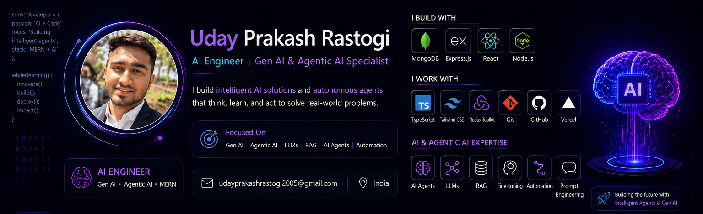

<!-- Banner -->
<p align="center">
  
</p>

<h1 align="center">Hi 👋, I'm Uday Prakash Rastogi</h1>

<h3 align="center">
🚀 AI Engineer | Gen AI & Agentic AI Specialist | MERN Stack Developer
</h3>

<p align="center">
  
</p>

---

## 🧠 About Me

```yaml
Name: Uday Prakash Rastogi
Role: AI Engineer & MERN Stack Developer
Location: India 🇮🇳

Focus Areas:
  - Generative AI
  - Agentic AI
  - LLM Applications
  - AI Agents
  - RAG Systems
  - Intelligent Automation
  - Full Stack Development

Currently Building:
  - AI Agents
  - Multi-Agent Systems
  - RAG Applications
  - MERN Stack Projects
```

### 🚀 Mission

Building intelligent AI solutions and autonomous agents that can reason, automate workflows, and solve real-world problems through innovation and technology.

---

## ⚡ AI & Agentic AI Stack

<p align="center">

</p>

<p align="center">


</p>

---

## 🔥 Current Focus

- 🤖 Building Autonomous AI Agents
- 🧠 Multi-Agent AI Systems
- 📚 Retrieval-Augmented Generation (RAG)
- ⚡ LLM Application Development
- 🌐 AI-Powered MERN Applications
- 🚀 Production-Ready AI Solutions

---

## 🚀 Featured Projects

| Project | Description |
|----------|-------------|
| 🤖 AI Agent Platform | Autonomous task-solving agents |
| 📚 RAG Assistant | Context-aware AI chatbot |
| 🎮 Smart Hangman | AI-enhanced game experience |
| 🌐 Skill Swap Platform | Full-stack MERN application |

---

## 📊 GitHub Analytics

<p align="center">


</p>

<p align="center">

</p>

---

## 🏆 GitHub Achievements

<p align="center">

</p>

---

## 🌐 Connect With Me

<p align="center">

<a href="mailto:udayprakashrastogi2005@gmail.com">

</a>

<a href="https://www.linkedin.com/in/uday-prakash-rastogi-33b55a2a2/">

</a>

<a href="https://swapskill.vercel.app/">

</a>

</p>

---

<p align="center">

### 🚀 Building the Future with Intelligent Agents & Gen AI

</p>
